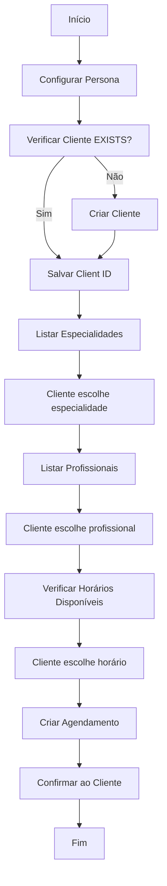

# Guia de Integração N8N - Next Schedule API

## 📋 Índice

1. [Visão Geral](#visão-geral)
2. [Autenticação](#autenticação)
3. [Endpoints Disponíveis](#endpoints-disponíveis)
4. [Fluxo Completo de Agendamento](#fluxo-completo-de-agendamento)
5. [Exemplos de Requests e Responses](#exemplos-de-requests-e-responses)
6. [Tratamento de Erros](#tratamento-de-erros)

---

## 🎯 Visão Geral

A API do Next Schedule foi desenvolvida para integração com ferramentas de automação como N8N, permitindo criar um assistente virtual completo para agendamento de consultas. Todos os endpoints estão disponíveis em:

**Base URL:** `https://seu-dominio.com/api/integrations`

**Documentação Swagger:** `https://seu-dominio.com/api-doc`

---

## 🔐 Autenticação

Todas as requisições devem incluir a API Key no header:

```http
Authorization: Bearer SUA_API_KEY
```

**OU**

```http
x-api-key: SUA_API_KEY
```

> 💡 **Importante:** A API Key é gerada no sistema em `/apikey` e está vinculada a uma clínica específica. Todos os dados retornados/criados são automaticamente filtrados pela clínica da API Key.

---

## 📡 Endpoints Disponíveis

### 1. 🤖 Obter Persona da IA

**Endpoint:** `GET /api/integrations/clinic-persona`

**Descrição:** Retorna a configuração de personalidade do assistente IA para a clínica.

**Query Parameters:**

- `phone` (string, obrigatório) - Telefone da clínica (com DDD, 11 dígitos)

**Response 200:**

```json
{
  "clinicId": "uuid",
  "clinicName": "Clínica Exemplo",
  "clinicType": "Odontologia",
  "persona": {
    "assistantTone": "Profissional e amigável",
    "welcomeMessage": "Olá! Bem-vindo à Clínica Exemplo.",
    "rules": [
      "Não fornecer diagnósticos médicos",
      "Sempre confirmar informações do paciente"
    ],
    "appointmentFlow": [
      "Perguntar o nome do paciente",
      "Verificar disponibilidade",
      "Confirmar data e horário"
    ],
    "forbiddenTopics": ["Política", "Religião"],
    "availability": "Seg-Sex 08:00-18:00",
    "language": "pt-BR"
  }
}
```

**Quando usar:** No início da conversa para configurar o comportamento do assistente.

---

### 2. 👤 Verificar/Criar Cliente

#### 2.1 Verificar se Cliente Existe

**Endpoint:** `GET /api/integrations/clients`

**Query Parameters:**

- `email` (string, obrigatório) - Email do cliente
- `phoneNumber` (string, obrigatório) - Telefone com 11 dígitos (ex: "11999999999")

**Response 200 (Cliente encontrado):**

```json
{
  "client": {
    "id": "uuid",
    "name": "João Silva",
    "email": "joao@email.com",
    "phoneNumber": "11999999999",
    "sex": "male",
    "status": "active"
  }
}
```

**Response 404 (Cliente não encontrado):**

```json
{
  "message": "Cliente não encontrado"
}
```

#### 2.2 Criar Novo Cliente

**Endpoint:** `POST /api/integrations/clients`

**Body:**

```json
{
  "name": "João Silva",
  "email": "joao@email.com",
  "phoneNumber": "11999999999",
  "sex": "male"
}
```

**Valores aceitos para `sex`:** `"male"` ou `"female"`

**Response 201:**

```json
{
  "client": {
    "id": "uuid",
    "name": "João Silva",
    "email": "joao@email.com",
    "phoneNumber": "11999999999",
    "sex": "male",
    "status": "active"
  }
}
```

**Response 409 (Cliente já existe):**

```json
{
  "message": "Cliente já cadastrado com este email e telefone"
}
```

---

### 3. 🏥 Listar Especialidades Disponíveis

**Endpoint:** `GET /api/integrations/specialties`

**Response 200:**

```json
{
  "specialties": ["Cardiologia", "Dermatologia", "Odontologia", "Psicologia"]
}
```

**Quando usar:** Após verificar/criar o cliente, para mostrar as opções disponíveis.

---

### 4. 👨‍⚕️ Listar Profissionais

**Endpoint:** `GET /api/integrations/professionals`

**Query Parameters (opcionais):**

- `specialty` (string) - Filtrar por especialidade

**Exemplos:**

- Todos: `/api/integrations/professionals`
- Por especialidade: `/api/integrations/professionals?specialty=Odontologia`

**Response 200:**

```json
{
  "professionals": [
    {
      "id": "uuid",
      "name": "Dr. Carlos Santos",
      "specialty": "Odontologia",
      "appointmentPriceInCents": 15000,
      "availableFromWeekDay": 1,
      "availableToWeekDay": 5,
      "availableFromTime": "08:00",
      "availableToTime": "18:00"
    }
  ]
}
```

**Dias da semana:**

- `0` = Domingo
- `1` = Segunda
- `2` = Terça
- `3` = Quarta
- `4` = Quinta
- `5` = Sexta
- `6` = Sábado

**Preço:** O valor está em **centavos**. Ex: `15000` = R$ 150,00

---

### 5. 📅 Verificar Horários Disponíveis

**Endpoint:** `GET /api/integrations/available-slots`

**Query Parameters:**

- `professionalId` (uuid, obrigatório) - ID do profissional
- `date` (string, obrigatório) - Data no formato YYYY-MM-DD

**Exemplo:** `/api/integrations/available-slots?professionalId=uuid&date=2024-12-25`

**Response 200:**

```json
{
  "availableSlots": ["08:00", "09:00", "10:00", "14:00", "15:00"],
  "professionalId": "uuid",
  "professionalName": "Dr. Carlos Santos",
  "date": "2024-12-25",
  "appointmentPriceInCents": 15000
}
```

**Response 200 (Profissional não trabalha neste dia):**

```json
{
  "availableSlots": [],
  "message": "Profissional não trabalha neste dia da semana"
}
```

---

### 6. ✅ Criar Agendamento

**Endpoint:** `POST /api/integrations/appointments`

**Body:**

```json
{
  "clientId": "uuid",
  "professionalId": "uuid",
  "date": "2024-12-25",
  "time": "14:30",
  "appointmentPriceInCents": 15000
}
```

**Response 200:**

```json
{
  "appointment": {
    "id": "uuid",
    "clientId": "uuid",
    "professionalId": "uuid",
    "clinicId": "uuid",
    "date": "2024-12-25T14:30:00.000Z",
    "appointmentPriceInCents": 15000,
    "status": "pending"
  }
}
```

**Response 409 (Horário já ocupado):**

```json
{
  "message": "Horário indisponível"
}
```

---

### 7. ✏️ Atualizar Agendamento

**Endpoint:** `PUT /api/integrations/appointments?id={appointmentId}`

**Query Parameters:**

- `id` (uuid, obrigatório) - ID do agendamento

**Body (todos campos opcionais):**

```json
{
  "date": "2024-12-26",
  "time": "15:00",
  "professionalId": "uuid"
}
```

**Response 200:**

```json
{
  "appointment": {
    "id": "uuid",
    "clientId": "uuid",
    "professionalId": "uuid",
    "date": "2024-12-26T15:00:00.000Z",
    "appointmentPriceInCents": 15000
  }
}
```

---

### 8. 📋 Listar Agendamentos do Cliente

**Endpoint:** `GET /api/integrations/appointments`

**Query Parameters:**

- `clientId` (uuid, obrigatório) - ID do cliente

**Response 200:**

```json
{
  "appointments": [
    {
      "id": "uuid",
      "date": "2024-12-25T14:30:00.000Z",
      "professional": {
        "name": "Dr. Carlos Santos",
        "specialty": "Odontologia"
      },
      "status": "pending"
    }
  ]
}
```

---

### 8. ❌ Cancelar Agendamento

**Endpoint:** `DELETE /api/integrations/appointments?id={appointmentId}`

**Query Parameters:**

- `id` (uuid, obrigatório) - ID do agendamento

**Response 200:**

```json
{
  "message": "Agendamento cancelado com sucesso"
}
```

---

## 🔄 Fluxo Completo de Agendamento (Passo a Passo)

### Passo 1: Configurar Persona da IA ⚙️

```
GET /api/integrations/clinic-persona?phone=11999999999
```

**Objetivo:** Carregar a personalidade, tom e regras do assistente.

**Próximo passo:** Iniciar conversa com o paciente.

---

### Passo 2: Verificar se o Cliente Existe 🔍

```
GET /api/integrations/clients?email=joao@email.com&phoneNumber=11999999999
```

**Cenário A - Cliente encontrado (200):**

- ✅ Salvar o `client.id`
- Ir para **Passo 3**

**Cenário B - Cliente não encontrado (404):**

- Ir para **Passo 2.1**

---

### Passo 2.1: Criar Novo Cliente 📝

```
POST /api/integrations/clients
{
  "name": "João Silva",
  "email": "joao@email.com",
  "phoneNumber": "11999999999",
  "sex": "male"
}
```

**Ação:** Salvar o `client.id` retornado e ir para **Passo 3**.

---

### Passo 3: Listar Especialidades 🏥

```
GET /api/integrations/specialties
```

**Ação:** Apresentar as especialidades ao cliente e aguardar escolha.

**Exemplo de resposta ao cliente:**

> "Temos as seguintes especialidades disponíveis: Cardiologia, Dermatologia, Odontologia. Qual você deseja?"

---

### Passo 4: Listar Profissionais da Especialidade 👨‍⚕️

```
GET /api/integrations/professionals?specialty=Odontologia
```

**Ação:** Apresentar os profissionais com nome, preço e disponibilidade.

**Exemplo de resposta ao cliente:**

> "Para Odontologia, temos:
>
> - Dr. Carlos Santos (R$ 150,00) - Disponível Seg-Sex das 08:00 às 18:00
>   Qual profissional você prefere?"

---

### Passo 5: Verificar Horários Disponíveis 📅

```
GET /api/integrations/available-slots?professionalId=uuid&date=2024-12-25
```

**Ação:** Apresentar os horários livres para o cliente escolher.

**Exemplo de resposta ao cliente:**

> "Para o Dr. Carlos no dia 25/12, temos os seguintes horários disponíveis: 08:00, 09:00, 10:00, 14:00, 15:00. Qual prefere?"

---

### Passo 6: Criar o Agendamento ✅

```
POST /api/integrations/appointments
{
  "clientId": "uuid-do-passo-2",
  "professionalId": "uuid-do-passo-4",
  "date": "2024-12-25",
  "time": "14:00",
  "appointmentPriceInCents": 15000
}
```

**Ação:** Confirmar o agendamento e informar o cliente.

**Exemplo de resposta ao cliente:**

> "Agendamento confirmado! ✅
>
> **Detalhes:**
>
> - Paciente: João Silva
> - Profissional: Dr. Carlos Santos
> - Especialidade: Odontologia
> - Data: 25/12/2024
> - Horário: 14:00
> - Valor: R$ 150,00
>
> Te enviaremos uma confirmação por email!"

---

## 🚨 Tratamento de Erros

### Códigos de Status HTTP

| Código | Significado         | Ação Recomendada                     |
| ------ | ------------------- | ------------------------------------ |
| `200`  | Sucesso             | Processar resposta normalmente       |
| `201`  | Criado com sucesso  | Item foi criado                      |
| `400`  | Requisição inválida | Verificar formato dos dados enviados |
| `401`  | Não autorizado      | Verificar API Key                    |
| `404`  | Não encontrado      | Recurso não existe                   |
| `409`  | Conflito            | Dado duplicado ou horário ocupado    |
| `500`  | Erro interno        | Tentar novamente ou reportar         |

### Exemplos de Tratamento

#### Erro 400 - Validação

```json
{
  "message": "Payload inválido",
  "issues": [
    {
      "path": ["phoneNumber"],
      "message": "String must contain exactly 11 character(s)"
    }
  ]
}
```

**Ação:** Informar ao cliente que o dado está incorreto e solicitar novamente.

#### Erro 409 - Horário Ocupado

```json
{
  "message": "Horário indisponível"
}
```

**Ação:** Informar ao cliente e sugerir outros horários disponíveis.

---

## 📝 Notas Importantes

### Formato de Telefone

- **Sempre use 11 dígitos:** DDD + número
- **Exemplo:** `11999999999` (São Paulo)
- **Sem formatação:** Não use parênteses, hífens ou espaços

### Formato de Data e Hora

- **Data:** `YYYY-MM-DD` (ex: `2024-12-25`)
- **Hora:** `HH:mm` (ex: `14:30`)

### Valores Monetários

- Todos os preços são em **centavos**
- Para converter: `R$ 150,00 = 15000 centavos`
- Para exibir: `15000 centavos = R$ 150,00`

### Dias da Semana

```
0 = Domingo
1 = Segunda-feira
2 = Terça-feira
3 = Quarta-feira
4 = Quinta-feira
5 = Sexta-feira
6 = Sábado
```

---

## 🎯 Fluxograma Resumido



---

## 🧪 Testando a Integração

1. **Gere uma API Key** no sistema em `/apikey`
2. **Use o Swagger** em `https://seu-dominio.com/api-doc` para testar os endpoints
3. **Configure o N8N** com os headers de autenticação
4. **Teste o fluxo completo** seguindo os passos acima

---

## 📞 Suporte

Para dúvidas ou problemas, consulte:

- **Documentação Swagger:** `/api-doc`
- **Logs do sistema:** Verifique os erros retornados nas responses

---

**Última atualização:** Novembro 2025
**Versão da API:** 1.0
